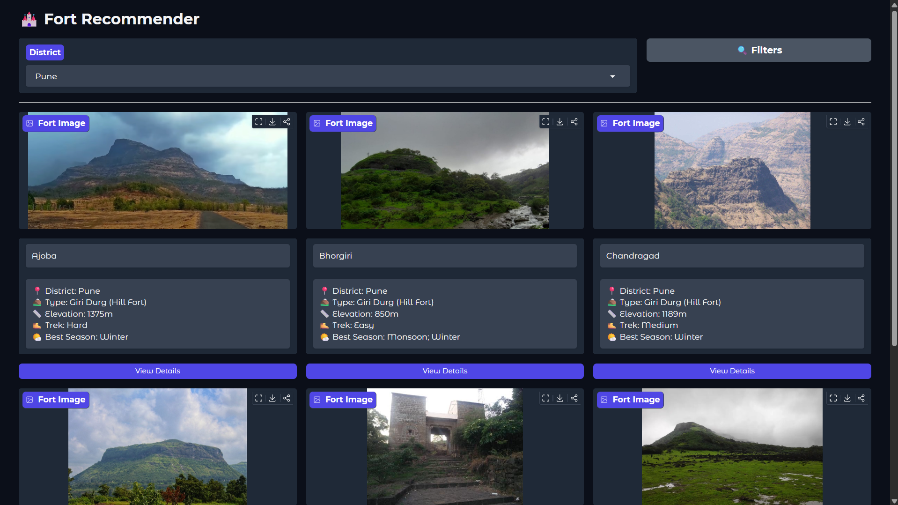
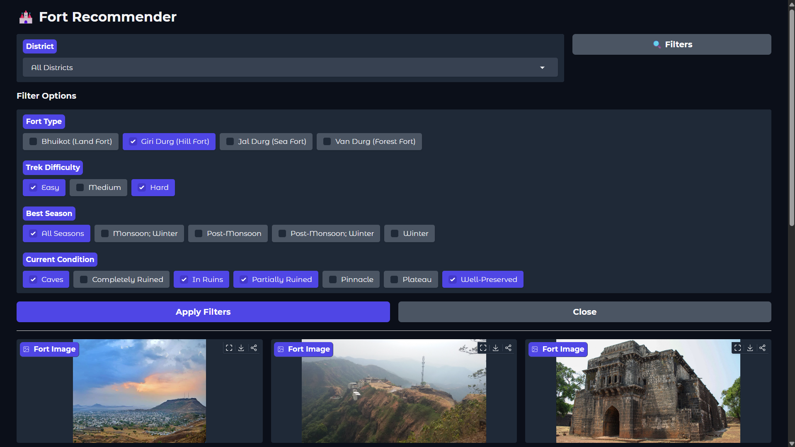
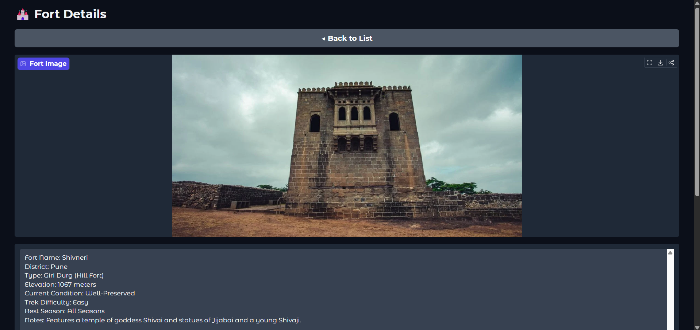

## 📌**Overview:**
The Maharashtra Forts Recommender is a filter-based recommendation system that helps users discover forts across Maharashtra based on their preferences. 
Users can apply multiple filters such as trek difficulty, district, season, fort condition, and fort type to find forts that best match their requirements. 
The system provides details about each recommended fort, making it useful for travelers, trekkers, and history enthusiasts exploring Maharashtra's rich heritage.

## ✨ **Features:**
1. District-Wise Recommendations:- Recommends all forts located in a user specified district.
2. Multi-Filter Options:- Find forts based on trek difficulty, district, season, fort condition and fort type.
3. Fort Information:- View details such as fort name, image, elevation, location, best season to visit, trek difficulty, and a short fort description.
4. Interactive UI:- A Gradio-based web dashboard for seamless user experience.

## 🛠️ **Tech Stack:**
1. Programming Language:- Python
2. Data Processing:- pandas, numpy
3. Data Visualization:- matplotlib, seaborn
4. Web App UI:- gradio

## 🏗 **Working:**
1. Dataset:- Uses dataset from kaggle.
2. Data Cleaning:- Removes duplicates and unwanted information and standardizes formatting.
3. Filter Selection:- Users can choose one or multiple filters.
4. Recommendation Generation:- The system filters the dataset based on the selected options and recommends matching forts.
5. Result Display:- Recommended forts are displayed along with important details.

## 🚀 **Live Demo:**
Will be available soon!

## 📸 **Screenshots:**
### 🏠 Image 1

### 🏠 Image 2

### 🏠 Image 3

## 🤝 **Contributing:**
Contributions are welcome! Feel free to fork the repository and submit a pull request.

## 📬 **Contact:**
Krishnathombare43@gmail.com

⭐**~ If you found this project useful, consider starring the repository!**
